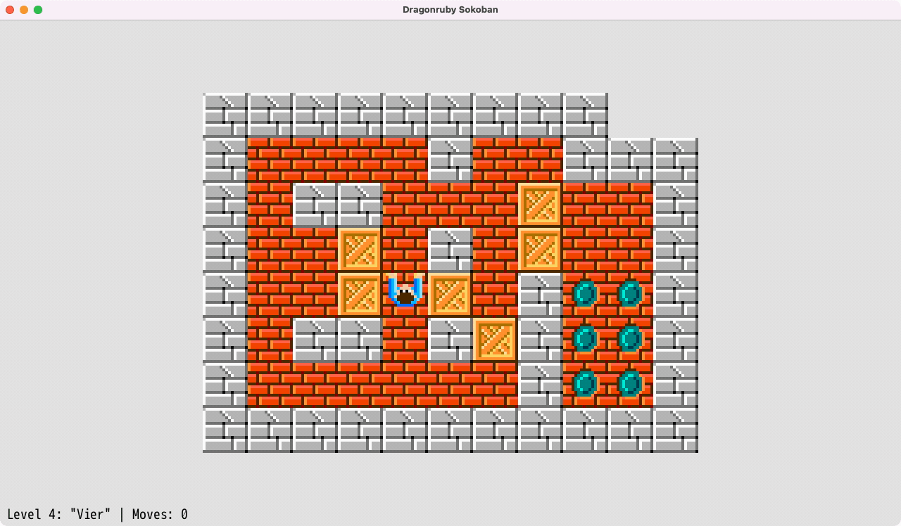

# DragonRuby Sokoban Game

I try to rebuild Sokoban in DragonRuby.

## Gameplay



## Download and Play

### [Play DragonRuby Sokoban on itch.io](https://webmatze.itch.io/dragonruby-sokoban)</a>

## Install dependencies

```bash
# Install smaug
$ brew tap ereborstudios/tap
$ brew install smaug

# Install dependencies
$ smaug dragonruby install ~/Downloads/dragonruby-gtk-macos.zip
$ smaug install
```

## Run the game
```bash
$ smaug run
```
